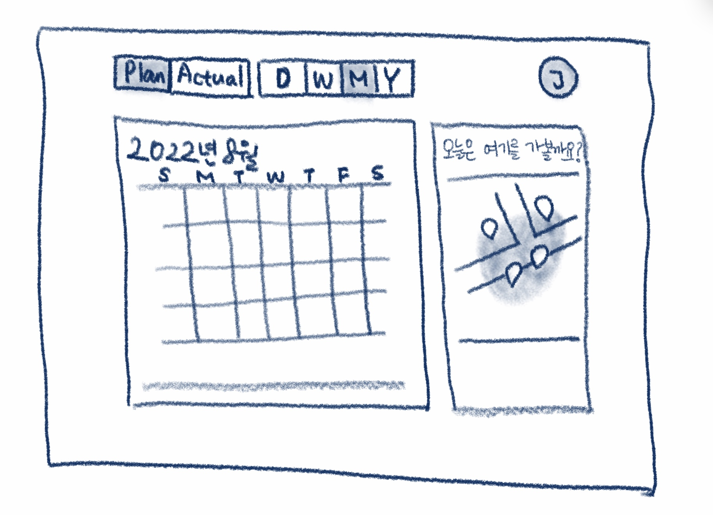

# Map-Calendar-App

개발하고 싶어서 만드는 앱.

### [구상]

.

- 메인 화면 1개
  - 왼쪽 2/3에 달력
  - 오른쪽 1/3에 지도

- 달력
  - <Year / Month / Week / Day> 별 확인 (기본: Month)
  - <Plan(계획한 스케줄) / Actual(실제 수행한 스케줄)> 별 확인 (기본: Plan)
  - 스케줄 등록 with (내용, 시간, 장소(지도 검색 혹은 직접 입력), 메모)
  - 레퍼런스: 애플 기본 캘린더
- 지도
  - 스케줄에 등록된 장소를 현재 선택된 <Year / Month / Week / Day> 단위의 날짜로 필터하여, 화면에서 마커 및 폴리곤으로 안내
    - 마커는 장소를 나타내고, 폴리곤은 마커들을 취합한 영역을 나타냄
    - 지도 title 예시) 오늘은 여기를 가볼까요? / 이번주는 여기를 가봤어요 / 지난 1년동안 방문한 지역이에요 등
  - 레퍼런스: 없음
- 소셜 로그인 연동하여 개인별 이용토록 하고 싶으나.. 일단은 패스

- github page로 간단하게 배포하거나, 구글 위젯으로 만들어 새 탭 열 때 나타나게 하려고 함.
